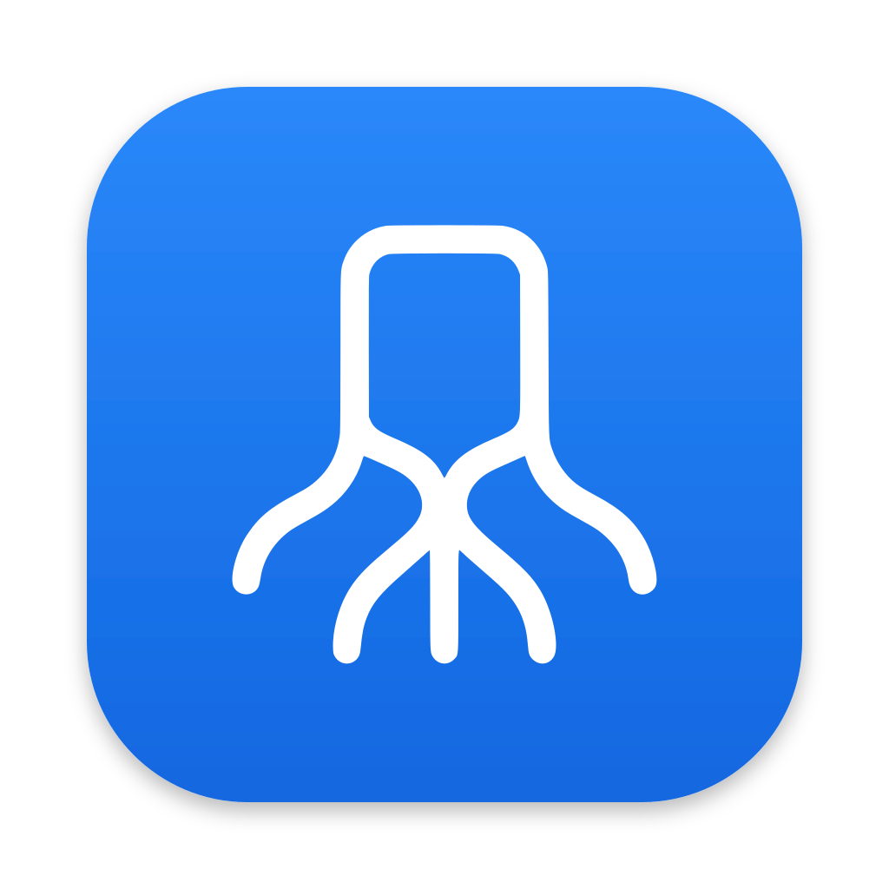
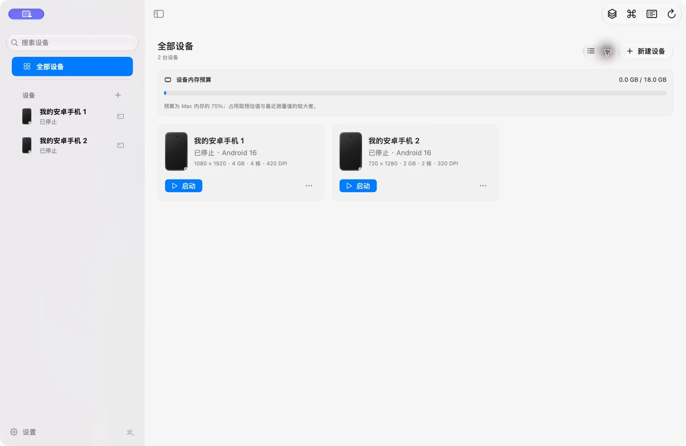
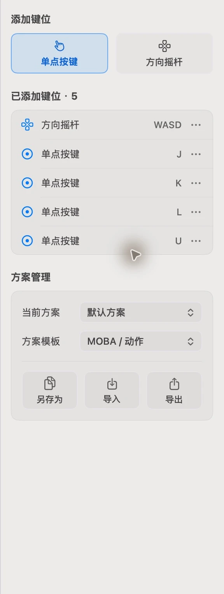
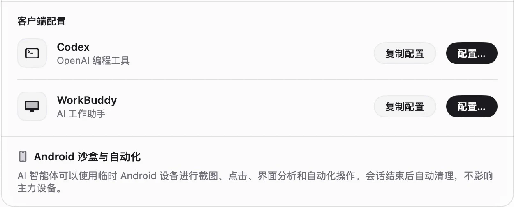

<div align="center">



# JIdr Plus

**在 Mac 上运行 Android，轻松管理设备、操作游戏和执行自动化任务。**

基于 [Jidr](https://github.com/AbdurahmanAlmehdi/jidr) 开发的开源 Android 模拟器管理工具，面向 Apple Silicon Mac。

<p>
  
  
  
  
</p>

[功能介绍](#功能介绍) · [安装与使用](#安装与使用) · [AI 与自动化](#ai-与自动化) · [文档](#文档)

<p>
  <picture>
    <source media="(prefers-color-scheme: dark)" srcset="docs/assets/readme/devices-dark.webp">
    
  </picture>
</p>

</div>

## 功能介绍

### 管理 Android 设备

在设备中心创建、启动、停止和切换模拟器，管理设备配置、快照和内存预算。将 APK 拖入模拟器窗口即可安装；也可以只读复用现有 Android SDK 和系统镜像。

### 键盘、鼠标和手柄都能用

在画面上布置点击键位和虚拟摇杆，使用 WASD 或方向键操作。内置 MOBA、射击和街机模板，支持保存多套方案及导入导出；连接 Mac 的物理手柄也可以转发到 Android 设备。

<p align="center"></p>

### 多开时，只操作一台就够了

选择主控设备，将触控、按键和文字输入同步到多台跟随设备。支持拉伸或等比留黑的坐标适配、锁定跟随端输入，以及切换主控设备。

<p align="center"></p>

### 把重复操作录下来

在模拟器窗口中录制触控、按键和文本输入，保存为本地脚本；回放时可以设置次数、循环间隔和播放速度，也可以配合多设备同步使用。

### 开发调试与 AI 自动化

选择适合设备的 Root 模式，使用网络、日志、定位、传感器、摄像头、系统证书和文件同步等工具。通过 CLI 或 MCP，AI 智能体可以读取设备画面与界面结构，执行点击、滑动和文字输入，并使用临时设备池。

<p align="center"></p>

<details>
<summary><strong>查看更多功能</strong></summary>

| 功能 | 说明 |
| --- | --- |
| 屏幕与媒体 | 窗口缩放、旋转、截图、录屏和设备音频录制 |
| 应用与文件 | APK 安装、应用管理、文件推送与拉取 |
| 文件夹同步 | Mac 与 Android 单向或双向同步，支持冲突处理 |
| 网络工具 | HTTP 代理、丢包和 DNS 状态模拟 |
| 设备模拟 | GPS 路线、电池、传感器、摄像头、指纹、电话和短信 |
| 存储管理 | SDK 与镜像管理、设备数据迁移 |
| 效率工具 | `⌘K` 命令面板、任务中心、快捷键及中英文界面 |

</details>

## 安装与使用

需要 **Apple Silicon Mac，macOS 13 或更高版本**。

1. 从 [GitHub Releases](https://github.com/hbdzh/JIdr-plus/releases/latest) 下载 DMG。
2. 打开 DMG，将 JIdr 拖入“应用程序”文件夹。
3. 启动 JIdr，按引导准备 Android SDK 和系统镜像，也可以复用已安装的 Android SDK。

## AI 与自动化

除了桌面界面，JIdr Plus 还提供 `jidr` 命令行和 MCP 服务。打开「设置 → 智能体」可以配置支持的客户端，详情见 [MCP 使用指南](docs/mcp.md)。

```bash
jidr mcp
```

## 从源码编译

需要 [Rust](https://rustup.rs/)、Xcode 和 `protoc`。

```bash
git clone https://github.com/hbdzh/JIdr-plus.git
cd JIdr-plus
cargo build --release -p jidr
bash apps/jidr-swiftui/build-center.sh
```

## 文档

[设备中心](docs/device-center.md) · [命令行](docs/cli.md) · [MCP](docs/mcp.md) · [Root](docs/root.md) · [控制协议](docs/control-protocol.md) · [贡献指南](CONTRIBUTING.md)

## 开源与致谢

JIdr Plus 基于 [Jidr](https://github.com/AbdurahmanAlmehdi/jidr) 开发，感谢原项目及其贡献者。Swift/AppKit 界面采用 [GPL-3.0-only](apps/jidr-swiftui/LICENSE-GPL)，Rust 桥、CLI 和后台采用 [Apache-2.0](LICENSE-APACHE)。第三方组件许可见 [NOTICE](NOTICE)。
